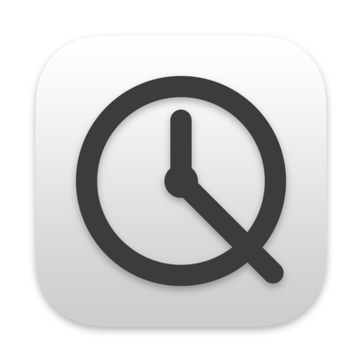
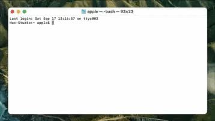
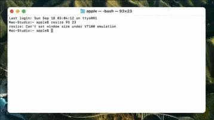

# 
<p align="center">

<h1 align="center">QDelayer</h1>
<h3 align="center">为macOS的 ⌘Q 快捷键添加延时, 防止误触</h3> 
</p>

## 运行截图
<p align="center">
   
</p>

## 安装与使用
### 安装:
可[点此前往](../../releases/latest)下载最新版安装文件. 或使用homebrew安装:  
```bash
brew install lihaoyun6/tap/qdelayer
```
### 使用:
QDelayer 启动后会在菜单栏显示图标, 使用过程中不再产生其他窗口.  
您可以点击 QDelayer 菜单中的App名称来切换 QDelayer 是否对其生效.  
还可以使用右键点击 QDelayer 的菜单栏图标来临时禁用或者启用它.  

## 常见问题
**1. 为什么我的 QDelayer 提示没有倒计时动画效果?**  
> 请在 QDelayer 偏好设置中启用"倒计时动画"选项即可.  

**2. 如何延长或缩短 QDelayer 的等待时长或双击间隔?**  
> 可在偏好设置中的"延时设置..."选项中设置.  

**3. 有没有除了长按快捷键以外的其他触发方法?**  
> 在偏好设置中启用"双击代替长按"功能, 即可使用快速连按两次的方式触发.

**4. 可以拦截除了 ⌘Q 之外的其他快捷键吗?**  
> 可以, 在偏好设置中启用"拦截 ⌘W 键"就可以对 ⌘W 快捷键启用双击防误触模式.

**5. 我只想让 QDelayer 对某几个 App 生效, 其他挨个取消太麻烦了怎么办?**
> 可在 QDelayer 偏好设置中启用"白名单模式"选项, 在此模式下  QDelayer 仅会对选中的 App 生效.  

## 致谢
[HotKey](https://github.com/soffes/HotKey) @soffes  

## 赞助

