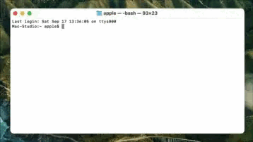
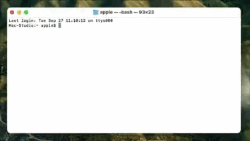

# 
<p align="center">

<h1 align="center">QDelayer</h1>
<h3 align="center">Block the ⌘Q and ⌘W hotkey for macOS<br><a href="./">[中文版本]</a></h3> 
</p>

## Screenshot
<p align="center">
   
</p>

## Installation & Usage
### Install:
You can download the latest release [here](../../releases/latest).  
or    
Install via homebrew:  
```bash
brew install lihaoyun6/tap/qdelayer
```
### Usage:
When you start QDelayer, it will display an icon in the status bar.  
You can click the icon to open the menu, and modify the blacklist by clicking the app name in the QDelayer menu.  
You can also disable or enable QDelayer by right-clicking on the status bar icon.

## Q&A
**1. Why does my QDelayer OSD have no animation?**  
> Please enable "Animation" in QDelayer Preferences.   

**2. Can I use double press instead of press and hold??**  
> Just enable "Double Press Mode" in your preferences.

**3. How to set the delay or double click interval?**  
> You can change it in "Set Delay..." in the preferences. 

**4. Why can't my QDelayer block the ⌘W?**  
> You need to enable "Also Block ⌘W" in your preferences.

**5. I want to use whitelist mode instead of blacklist mode.**
> You can switch to whitelist mode by enabling "Whitelist Mode" in your preferences.  

## Thanks
[HotKey](https://github.com/soffes/HotKey) @soffes  
